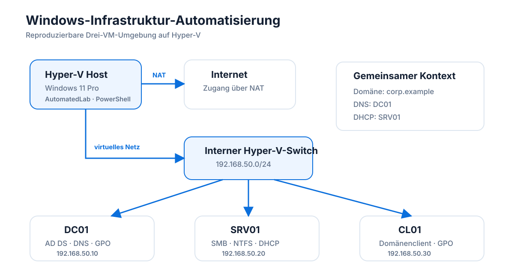
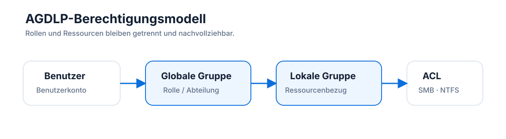

# Architektur

## Zielbild

Das Lab stellt eine kleine, klar getrennte Windows-Infrastruktur auf einem einzelnen Hyper-V-Host bereit. Die Umgebung besteht aus drei virtuellen Maschinen und einem internen virtuellen Netzwerk.



## Rollen

### DC01

DC01 übernimmt die zentralen Identitäts- und Namensdienste:

- Active Directory Domain Services
- DNS
- Gruppenrichtlinienverwaltung
- OU-, Benutzer- und Gruppenstruktur
- zentrale Sicherheitsrichtlinien

### SRV01

SRV01 bildet typische Mitgliedsserver-Aufgaben ab:

- SMB-Dateifreigaben
- NTFS-Berechtigungen
- DHCP
- domänenbasierte Zugriffssteuerung

### CL01

CL01 dient als Domänenclient für Funktions- und Zugriffstests:

- Domänenanmeldung
- Gruppenrichtlinien
- Netzlaufwerke
- SMB-Zugriffe
- DNS-/DHCP- und Netzwerkprüfungen

## Netzwerk

Die öffentliche Beispielkonfiguration verwendet:

```text
Netz:       192.168.50.0/24
Gateway:    192.168.50.1
DC01:       192.168.50.10
SRV01:      192.168.50.20
CL01:       192.168.50.30
DHCP:       192.168.50.100 - 192.168.50.199
Domäne:     corp.example
```

Der virtuelle Switch ist intern. Der Hyper-V-Host stellt über Windows NAT den Übergang zum externen Netzwerk bereit. Die internen Systeme verwenden DC01 als DNS-Server.

## Berechtigungsmodell

Das Dateiberechtigungsmodell folgt AGDLP:



Damit werden Benutzer nicht direkt auf Dateiordner berechtigt. Rollen und Ressourcen bleiben getrennt und nachvollziehbar.

## Automatisierungsgrenze

Der Hyper-V-Host startet die PowerShell-Automatisierung. Änderungen innerhalb der virtuellen Maschinen werden über AutomatedLab ausgeführt. Dadurch können Host-, Hypervisor- und Gastkonfigurationen in einem gemeinsamen Ablauf verbunden werden.

Die öffentliche Fassung verwendet eine lokale Konfigurationsdatei, die aus `config/lab.example.psd1` abgeleitet wird. Persönliche Pfade oder Zugangsdaten gehören nicht in das Repository.
